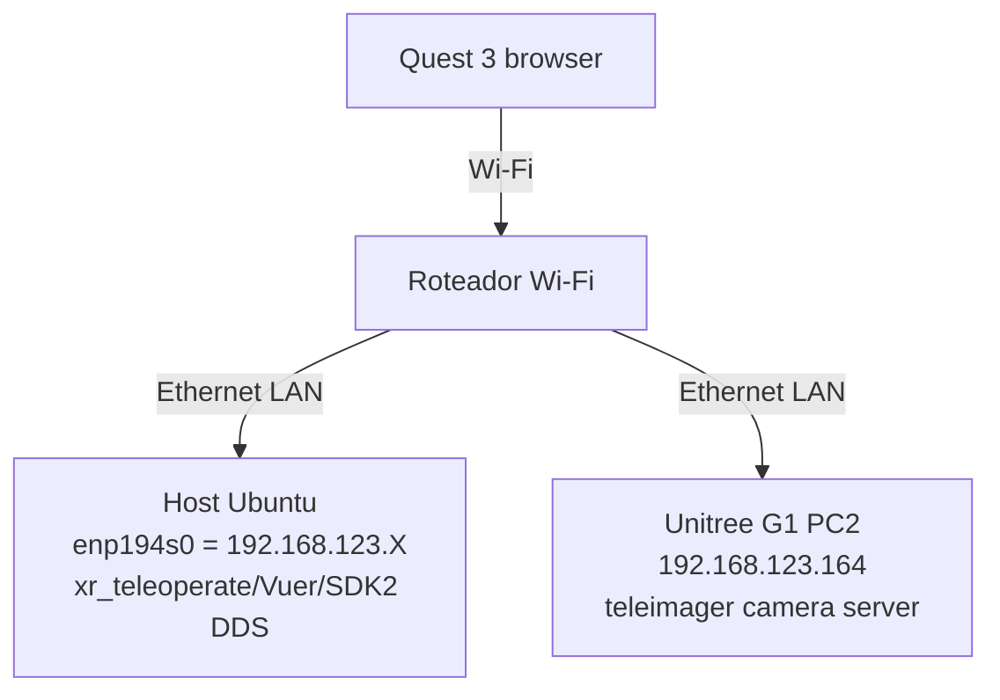

Os scripts de teleoperação estão no [repositório unitree-g1](https://github.com/MOBILAB-UDESC/unitree-g1).

A configuração ao final desse tutorial ficará como exemplificado no diagrama abaixo:



## Configuração do roteador

Baseado na documentação do repositório [xr_teleoperate](https://github.com/unitreerobotics/xr_teleoperate):

- [Router device](https://github.com/unitreerobotics/xr_teleoperate/wiki/Router_Device)
- [Network](https://github.com/unitreerobotics/xr_teleoperate/wiki/Network)

Condições ideais de Wi-Fi:

- 5GHz
- Largura de 80MHz ou 160MHz
- Sinal em torno de -50 dBm ou melhor
- Pouca sobreposição de canais

## Configuração no host

Adicione ao arquivo `packages/unitree_sdk2_python/unitree_sdk2py/core/channel_config.py`:

```python
ChannelConfigAutoDetermine = '''<?xml version="1.0"?>
<CycloneDDS>
  <Domain Id="any">
    <General>
      <Interfaces>
        <NetworkInterface autodetermine="true"/>
      </Interfaces>
      <AllowMulticast>spdp</AllowMulticast>
      <DontRoute>true</DontRoute>
    </General>
    <Discovery>
      <Peers>
        <Peer Address="192.168.123.161"/>
        <Peer Address="192.168.123.164"/>
      </Peers>
    </Discovery>
  </Domain>
</CycloneDDS>'''
```

Esta configuração é necessária porque o PC tem múltiplas interfaces de rede na mesma sub-rede:

- `enp194s0 = 192.168.123.2`
- `wlp195s0 = 192.168.123.106`

Sem a configuração explícita do DDS, a descoberta pode escolher a interface errada ou rotear inconsistentemente.

## Configuração do Meta Quest 3

Baseado nas instruções do repositório [xr_teleoperate](https://github.com/unitreerobotics/xr_teleoperate/wiki/XR_Device).

Ative o Modo Desenvolvedor no aplicativo Meta Horizon:

```text
Dispositivos -> seu Quest 3 -> Configurações do headset -> Modo Desenvolvedor -> ATIVADO
```

### Instalar `adb` no host

```sh
apt-get install adb
```

Liste os dispositivos:

```text
sudo adb devices
List of devices attached
2G0YC5ZG6P005M  unauthorized
```

1. Coloque o Quest 3 enquanto ele está conectado via USB.
2. Procure pelo alerta: _Allow USB debugging_?
3. Selecione _Always allow from this computer_ se disponível.
4. Pressione _Allow_.
5. Execute `sudo adb devices` novamente.

Saída esperada:

```text
2G0YC5ZG6P005M    device
```

Inicie o redirecionamento de porta:

```sh
sudo adb -s 2G0YC5ZG6P005M reverse tcp:8012 tcp:8012
```

Verifique o resultado:

```sh
sudo adb -s 2G0YC5ZG6P005M reverse --list
```

Saída esperada:

```text
UsbFfs tcp:8012 tcp:8012
```

### Configurar o certificado HTTPS

Gere um certificado autoassinado ([baseado na documentação da unitree](https://github.com/unitreerobotics/avp_teleoperate)):

```sh
openssl req -x509 -nodes -days 365 -newkey rsa:2048 -keyout key.pem -out cert.pem
```

## Configuração do Host

Siga as instruções do repositório [xr_teleoperate](https://github.com/unitreerobotics/xr_teleoperate). Siga as instruções de instalação. Embora estejamos usando `uv`, para o XR teleoperate siga as recomendações do conda:

https://github.com/unitreerobotics/xr_teleoperate#1--installation

## Configuração do PC2 (Unitree)

### Copiar certificados

Use SSH para criar o diretório de configuração no PC2 e copie os arquivos:

```sh
ssh unitree@192.168.123.164 'mkdir -p ~/.config/xr_teleoperate'
scp /home/alfakini/Developer/unitreeG1/cert.pem /home/alfakini/Developer/unitreeG1/key.pem unitree@192.168.123.164:~/.config/xr_teleoperate/
```

Verifique no PC2:

```sh
ssh unitree@192.168.123.164 'ls -l ~/.config/xr_teleoperate/'
```

Saída esperada:

```text
cert.pem
key.pem
```

Se o diretório `teleimager` no PC2 também esperar os arquivos diretamente:

```sh
scp /home/alfakini/Developer/unitreeG1/cert.pem /home/alfakini/Developer/unitreeG1/key.pem unitree@192.168.123.164:~/teleimager/
```

### Instalar pacotes no PC2

Estas notas resumem a instalação realizada nesta máquina para que possa ser reproduzida em outro sistema Ubuntu estilo Unitree/Jetson.

#### 1. Instalar Miniconda

```bash
wget https://repo.anaconda.com/miniconda/Miniconda3-latest-Linux-aarch64.sh -O /tmp/miniconda.sh
bash /tmp/miniconda.sh -b -u -p /home/unitree/miniconda3
rm /tmp/miniconda.sh
```

Se o Conda exigir aceitação dos Termos de Serviço do canal:

```bash
/home/unitree/miniconda3/bin/conda tos accept --override-channels --channel https://repo.anaconda.com/pkgs/main
/home/unitree/miniconda3/bin/conda tos accept --override-channels --channel https://repo.anaconda.com/pkgs/r
```

Inicialize o Conda para bash:

```bash
/home/unitree/miniconda3/bin/conda init bash
source ~/.bashrc
```

#### 2. Criar ambiente teleimager

```bash
/home/unitree/miniconda3/bin/conda create -n teleimager python=3.10 -y
conda activate teleimager
```

#### 3. Instalar pacotes do sistema

```bash
sudo apt update
sudo apt install -y libusb-1.0-0-dev libturbojpeg-dev
```

#### 4. Clonar e instalar Tele Imager

```bash
cd /home/unitree
git clone https://github.com/silencht/teleimager
cd teleimager
pip install -e ".[server]"
```

#### 5. Correção de dependência `logging_mp`

A versão atual do pacote `logging_mp` expõe `getLogger`, mas o Tele Imager `1.5.0` chama `get_logger`. Isso fazia tanto o `teleimager-server` quanto o `teleimager-client` falharem na inicialização.

Edite o `pyproject.toml` local, alterando:

```toml
"logging_mp",
```

para:

```toml
"logging_mp==0.1.6",
```

Em seguida, reinstale:

```bash
cd /home/unitree/teleimager
pip install -e ".[server]"
```

#### 6. Modificações no código TeleImager

As seguintes alterações foram feitas localmente no `teleimager` para suportar a câmera RealSense D435i em modo OpenCV.

##### 6a. `setup_uvc.sh` — Tolerante a driver UVC ocupado

O script original falhava quando o driver `uvcvideo` estava em uso. Agora ele avisa e continua:

```bash
if sudo $MODPROBE_PATH -r uvcvideo; then
    sudo $MODPROBE_PATH uvcvideo debug=0
else
    echo "Warning: uvcvideo is currently in use; skipping driver reload."
    echo "Stop camera/video services or reboot if you need to reload it."
fi
echo "UVC setup completed successfully."
```

Execute:

```bash
cd /home/unitree/teleimager
bash setup_uvc.sh
```

##### 6b. `src/teleimager/image_server.py` — Múltiplas correções

**UVC reload warning:**

```python
def reload_uvc_driver():
    try:
        subprocess.run("sudo modprobe -r uvcvideo", shell=True, check=True)
        time.sleep(1)
        subprocess.run("sudo modprobe uvcvideo debug=0", shell=True, check=True)
        time.sleep(1)
        logger_mp.info("UVC driver reloaded successfully.")
    except subprocess.CalledProcessError as e:
        logger_mp.warning(f"UVC driver is currently in use; skipping reload: {e}")
```

**RealSense import error inclui a exceção real:**

```python
def get_realsense_module(self) -> object:
    try:
        import pyrealsense2 as rs
        return rs
    except (ImportError, OSError) as e:
        msg = f"{msg}\nOriginal import error: {e}"
        raise RuntimeError(msg)
```

**`_is_like_rgb` — usa índice numérico V4L2 com até 3 tentativas:**

```python
def _is_like_rgb(self, video_path):
    source = int(video_path.replace("/dev/video", "")) if video_path.startswith("/dev/video") else video_path
    for _ in range(3):
        cap = cv2.VideoCapture(source, cv2.CAP_V4L2)
        if cap.isOpened():
            ret, frame = cap.read()
            cap.release()
            if ret and frame is not None and frame.ndim == 3 and frame.shape[2] == 3:
                return True
        else:
            cap.release()
        time.sleep(0.5)
    return False
```

**`OpenCVCamera.__init__` — usa índice numérico V4L2:**

```python
def __init__(self, cam_topic, video_path, img_shape, fps, ...):
    super().__init__(...)
    self._video_path = video_path
    source = int(self._video_path.replace("/dev/video", "")) if self._video_path.startswith("/dev/video") else self._video_path
    self.cap = cv2.VideoCapture(source, cv2.CAP_V4L2)
```

**`CameraFinder.__init__` — parâmetro `probe_rgb`:**

```python
def __init__(self, realsense_enable=False, verbose=False, probe_rgb=True):
    # ...
    self.uvc_rgb_video_paths = self._list_uvc_rgb_video_paths() if probe_rgb else []
```

**`ImageServer.__init__` — só faz probe RGB quando necessário:**

```python
probe_rgb = any(
    (cam_cfg.get("enable_zmq", False) or cam_cfg.get("enable_webrtc", False))
    and cam_cfg.get("type", "uvc").lower() in ("opencv", "uvc")
    and not cam_cfg.get("physical_path")
    for cam_cfg in cam_config.values()
)
self._cam_finder = CameraFinder(realsense_enable, camera_finder_verbose, probe_rgb=probe_rgb)
```

**`get_vpath_by_ppath` — resolve pelo menor índice da interface, sem probe OpenCV:**

```python
def get_vpath_by_ppath(self, physical_path):
    base = "/sys/class/video4linux/"
    matches = []
    for v in os.listdir(base):
        sys_path = os.path.realpath(os.path.join(base, v, "device"))
        if sys_path == physical_path:
            index_path = os.path.join(base, v, "index")
            try:
                index = int(open(index_path).read().strip())
            except Exception:
                index = 999
            matches.append((index, f"/dev/{v}"))
    if not matches:
        return None
    matches.sort()
    return matches[0][1]
```

##### 6c. `src/teleimager/image_client.py` — Suporte headless

```python
parser.add_argument('--no-display', action='store_true',
    help='Receive frames without opening OpenCV display windows')
args = parser.parse_args()
display_enabled = not args.no_display and bool(os.environ.get("DISPLAY"))
if not display_enabled:
    logger_mp.info("Display disabled; receiving frames without OpenCV windows.")
```

E cada `cv2.imshow(...)` envolvido em `if display_enabled:`.

#### 7. Configuração da câmera (`cam_config_server.yaml`)

```yaml
head_camera:
  enable_zmq: true
  zmq_port: 55555
  enable_webrtc: true
  webrtc_port: 60001
  webrtc_codec: h264
  type: opencv
  image_shape: [480, 640]
  binocular: false
  fps: 30
  video_id: null
  serial_number: null
  physical_path: /sys/devices/platform/3610000.xhci/usb2/2-3/2-3:1.3

left_wrist_camera:
  enable_zmq: false
  enable_webrtc: false

right_wrist_camera:
  enable_zmq: false
  enable_webrtc: false
```

> O `physical_path` usado é o da interface **RGB** da RealSense (sub-interface `1.3`, V4L2 index 0). Isso evita a ambiguidade de serial number (onde `/dev/video2` e `/dev/video4` compartilham o mesmo serial `252443060502`).

#### 8. Script de inicialização (`run_realsense_server.sh`)

Crie o arquivo `/home/unitree/teleimager/run_realsense_server.sh` com o seguinte conteúdo:

```bash
#!/bin/bash
set -euo pipefail

SERVER_BIN="${TELEIMAGER_SERVER:-/home/unitree/miniconda3/envs/teleimager/bin/teleimager-server}"
VIDEO_HUB="/unitree/module/video_hub_pc4/videohub_pc4"
STOPPED_MASTER=0

cleanup() {
    if [ "$STOPPED_MASTER" -eq 1 ]; then
        sudo systemctl start master_service || true
    fi
}

existing_server_pids=$(pgrep -f "teleimager-server" || true)
if [ -n "$existing_server_pids" ]; then
    echo "TeleImager server is already running: $existing_server_pids"
    echo "Stop it first with Ctrl+C in its terminal, or run: pkill -TERM -f teleimager-server"
    exit 1
fi

trap cleanup EXIT
sudo systemctl stop master_service || true
STOPPED_MASTER=1
sudo pkill -TERM -f "$VIDEO_HUB" || true
for _ in 1 2 3 4 5; do
    if ! pgrep -f "$VIDEO_HUB" > /dev/null; then
        break
    fi
    sleep 1
done

if pgrep -f "$VIDEO_HUB" > /dev/null; then
    sudo pkill -KILL -f "$VIDEO_HUB" || true
fi

"$SERVER_BIN"
```

Torne executável:

```bash
chmod +x /home/unitree/teleimager/run_realsense_server.sh
```

#### 9. Verificação

Verifique se os comandos estão disponíveis:

```bash
teleimager-server --help
teleimager-client --help
```

Execute a descoberta de câmera:

```bash
cd /home/unitree/teleimager
python -m teleimager.image_server --cf
```

#### 10. Uso típico no PC2

Inicie o servidor:

```bash
cd /home/unitree/teleimager
./run_realsense_server.sh
```

Para testar o stream localmente (PC2 com display):

```bash
teleimager-client --host 127.0.0.1
```

Ou em modo headless (PC2 sem display):

```bash
teleimager-client --host 127.0.0.1 --no-display
```

Portas usadas:

| Porta | Função               |
|-------|----------------------|
| 60000 | Config responder     |
| 55555 | ZMQ video stream     |
| 60001 | WebRTC               |

## Checklist de execução

Esta seção resume os passos e verificações necessários **toda vez** que for rodar a teleoperação, assumindo que a instalação e configuração já foram feitas.

### Topologia esperada

```text
Host:          enp194s0 = 192.168.123.2  (Ethernet para LAN)
               wlp195s0 = 192.168.123.106 (Wi-Fi para roteador)
PC2 (G1):      eth0    = 192.168.123.164 (Ethernet para LAN)
               wlan0   = 192.168.123.113 (Wi-Fi para roteador)
Robot G1 DDS:  192.168.123.161           (Ethernet para LAN)
Quest 3:       Wi-Fi  = 192.168.123.X    (Wi-Fi para roteador)
```

> Importante: Host e PC2 **não podem** usar Wi-Fi e Ethernet na mesma sub-rede sem rotas explícitas, ou o tráfego DDS/Vuer será roteado pela interface errada.

### 1. Verificações no Host

```bash
# 1. Interfaces com IP esperado
ip -4 addr show enp194s0     # deve mostrar 192.168.123.2/24
ip -4 addr show wlp195s0     # deve mostrar 192.168.123.106/24

# 2. Rota padrão via Wi-Fi (para Quest alcançar o host)
ip route show default

# 3. Rotas específicas para PC2 e robô via Ethernet
ip route get 192.168.123.164  # esperado: dev enp194s0 src 192.168.123.2
ip route get 192.168.123.161  # esperado: dev enp194s0 src 192.168.123.2

# 4. Ping para PC2 e robô
ping -c 2 192.168.123.164     # PC2 (camera server)
ping -c 2 192.168.123.161     # G1 controller (DDS peer)
```

Se os `ip route get` mostrarem `dev wlp195s0`, corrija com:

```bash
sudo ip route replace 192.168.123.164/32 dev enp194s0 src 192.168.123.2 metric 10
sudo ip route replace 192.168.123.161/32 dev enp194s0 src 192.168.123.2 metric 10
```

### 2. Verificações no PC2 (SSH)

```bash
ssh unitree@192.168.123.164

# 1. Interface com IP esperado
ip -4 addr show eth0     # deve mostrar 192.168.123.164/24

# 2. Rota para host
ip route get 192.168.123.2    # esperado: dev eth0 src 192.168.123.164

# 3. Ping para robô
ping -c 2 192.168.123.161     # deve responder (0.1-0.5ms)

# 4. Certificados instalados
ls -l ~/.config/xr_teleoperate/   # deve conter cert.pem e key.pem

exit
```

### 3. Iniciar camera server (PC2)

```bash
ssh unitree@192.168.123.164
source ~/.bashrc
conda activate teleimager
cd /home/unitree/teleimager
teleimager-server
# Deixe este terminal aberto
```

Saída esperada:

```text
[teleimager-server] Listening on port 60000
[teleimager-server] WebRTC server on port 60001
```

### 4. Configurar rotas (Host)

```bash
sudo ip route replace 192.168.123.164/32 dev enp194s0 src 192.168.123.2 metric 10
sudo ip route replace 192.168.123.161/32 dev enp194s0 src 192.168.123.2 metric 10
```

Verifique:

```bash
ip route get 192.168.123.164  # dev enp194s0
ip route get 192.168.123.161  # dev enp194s0
ping -c 2 192.168.123.164     # OK
ping -c 2 192.168.123.161     # OK
```

### 5. Iniciar teleop (Host)

```bash
cd ~/unitreeG1/packages/xr_teleoperate/teleop
conda activate tv
python teleop_hand_and_arm.py --arm=G1_29 --img-server-ip 192.168.123.164 --network-interface enp194s0
```

Saída esperada:

```text
Received camera config from server 192.168.123.164:60000
Enter debug mode: Success
[G1_29_ArmController] Subscribe dds ok.
Lock OK!
Initialize G1_29_ArmController OK!
Press [r] to start syncing the robot with your movements.
```

### 6. Conectar Quest 3

No navegador do Quest 3, abra:

```text
https://192.168.123.106:8012/?ws=wss://192.168.123.106:8012
```

Se aparecer aviso de certificado: **Avançado → Prosseguir (Inseguro)**.

Clique em **Virtual Reality** e aceite as permissões.

Confirme no terminal:

```text
websocket is connected. id:...
Uplink task running. id:...
```

### 7. Operar

1. Alinhe seus braços com a pose inicial do robô.
2. No terminal do host, pressione `r` para iniciar a teleoperação.
3. Para encerrar, pressione `q`.

### 8. Troubleshooting rápido

| Sintoma | Causa provável | Verificação |
|---------|---------------|-------------|
| Quest não carrega `https://...:8012` | Quest não alcança host Wi-Fi | `ip route get 192.168.123.146` no host |
| `Waiting to subscribe dds...` | Rota para `192.168.123.161` errada | `ip route get 192.168.123.161` |
| `Failed to negotiate WebRTC` | Camera server no PC2 não está rodando | `ssh unitree@192.168.123.164` + `ps aux \| grep teleimager` |
| Conexão cai ao andar | Isolamento Wi-Fi (AP isolation) no roteador | Verificar configuração do roteador |

## Câmera RealSense D435i

A câmera utilizada é uma Intel RealSense D435i conectada na **porta USB 9** do G1.


### Por que OpenCV em vez do SDK RealSense?

O modo nativo RealSense (`pyrealsense2`) não é compatível com o GLIBC do Ubuntu do G1 (aarch64). As wheels disponíveis para `pyrealsense2` exigem `GLIBC_2.32`, mas o sistema possui uma versão mais antiga. Por isso, a câmera é configurada em **modo OpenCV**, tratando a RealSense como uma câmera UVC padrão.

### Identificar o physical path

Conecte a câmera na porta USB 9 e execute:

```bash
rs-enumerate-devices
```

Saída esperada:

```text
Device info:
    Name                          : Intel RealSense D435I
    Serial Number                 : 406122071162
    Firmware Version              : 05.15.01.55
    Physical Port                 : /sys/devices/platform/3610000.xhci/usb2/2-3/2-3:1.0/video4linux/video0
```

O `Physical Port` completo aponta para a interface **1.0** (meta-dados). A interface RGB que queremos é a **1.3**:

```text
/sys/devices/platform/3610000.xhci/usb2/2-3/2-3:1.3
```

Para confirmar os dispositivos V4L2 associados:

```bash
ls -l /sys/class/video4linux/
```

E verificar qual índice V4L2 cada interface expõe:

```bash
for v in /sys/class/video4linux/video*; do
    echo "$(basename $v): interface=$(basename $(readlink $v/device)), index=$(cat $v/index 2>/dev/null), name=$(cat $v/name 2>/dev/null)"
done
```

### Configurar `cam_config_server.yaml`

No PC2, edite `/home/unitree/teleimager/cam_config_server.yaml`:

```yaml
head_camera:
  enable_zmq: true
  zmq_port: 55555
  enable_webrtc: true
  webrtc_port: 60001
  webrtc_codec: h264
  type: opencv
  image_shape: [480, 640]
  binocular: false
  fps: 30
  video_id: null
  serial_number: null
  physical_path: /sys/devices/platform/3610000.xhci/usb2/2-3/2-3:1.3
```

> O campo `physical_path` é a chave para o funcionamento correto. O `teleimager` modificado (veja seção 6b) usa `get_vpath_by_ppath()` para resolver o `physical_path` ao menor índice V4L2 disponível sob aquela interface USB, sem precisar fazer probe OpenCV.

### Iniciar o servidor

```bash
cd /home/unitree/teleimager
./run_realsense_server.sh
```

### Testar o stream

Do host:

```bash
conda activate tv
cd ~/unitreeG1/packages/xr_teleoperate/teleop
python -m teleimager.image_client --host 192.168.123.164 --no-display
```

Ou do próprio PC2 (com display):

```bash
teleimager-client --host 127.0.0.1
```

### Portas

| Porta | Função           |
|-------|------------------|
| 60000 | Config responder |
| 55555 | ZMQ video stream |
| 60001 | WebRTC           |

### Referências

- https://support.unitree.com/home/en/G1_developer
- https://github.com/unitreerobotics/xr_teleoperate/wiki/Camera_and_Image

