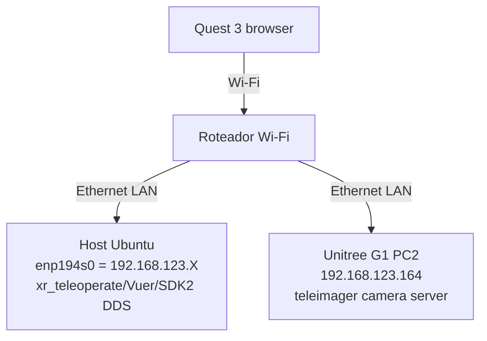

############################################################################################################# COLOCAR NA PRIMEIRA ENTRADA DA CONFIGURAÇÃO ou TELEOPERACAO

Os scripts de teleoperação estão no [repositório unitree-g1](https://github.com/MOBILAB-UDESC/unitree-g1).

A configuração ao final desse tutorial ficará como exemplificado no diagrama abaixo:




############################################################################################################# MENCIONAR DE ACORDO COM O MODO DE TELEOPERACAO

## Configuração do roteador

Baseado na documentação do repositório [xr_teleoperate](https://github.com/unitreerobotics/xr_teleoperate):

- [Router device](https://github.com/unitreerobotics/xr_teleoperate/wiki/Router_Device)
- [Network](https://github.com/unitreerobotics/xr_teleoperate/wiki/Network)

Condições ideais de Wi-Fi:

- 5GHz
- Largura de 80MHz ou 160MHz
- Sinal em torno de -50 dBm ou melhor
- Pouca sobreposição de canais
```


#############################################################################################################  TB MODIFICAR CONFORME O TIPO DE TELEOPERACAO

### 5. Iniciar teleop (Host)

```bash
cd ~/unitreeG1/packages/xr_teleoperate/teleop
conda activate tv
python teleop_hand_and_arm.py --arm=G1_29 --img-server-ip 192.168.123.164 --network-interface enp194s0
```

Saída esperada:

```text
Received camera config from server 192.168.123.164:60000
Enter debug mode: Success
[G1_29_ArmController] Subscribe dds ok.
Lock OK!
Initialize G1_29_ArmController OK!
Press [r] to start syncing the robot with your movements.
```

### 6. Conectar Quest 3

No navegador do Quest 3, abra:

```text
https://192.168.123.106:8012/?ws=wss://192.168.123.106:8012
```

Se aparecer aviso de certificado: **Avançado → Prosseguir (Inseguro)**.

Clique em **Virtual Reality** e aceite as permissões.

Confirme no terminal:

```text
websocket is connected. id:...
Uplink task running. id:...
```

### 7. Operar

1. Alinhe seus braços com a pose inicial do robô.
2. No terminal do host, pressione `r` para iniciar a teleoperação.
3. Para encerrar, pressione `q`.


###################################################################################################################################################### falar dos certificados!!!!!

### 8. Troubleshooting rápido

| Sintoma | Causa provável | Verificação |
|---------|---------------|-------------|
| Quest não carrega `https://...:8012` | Quest não alcança host Wi-Fi | `ip route get 192.168.123.146` no host |
| `Waiting to subscribe dds...` | Rota para `192.168.123.161` errada | `ip route get 192.168.123.161` |
| `Failed to negotiate WebRTC` | Camera server no PC2 não está rodando | `ssh unitree@192.168.123.164` + `ps aux \| grep teleimager` |
| Conexão cai ao andar | Isolamento Wi-Fi (AP isolation) no roteador | Verificar configuração do roteador |


