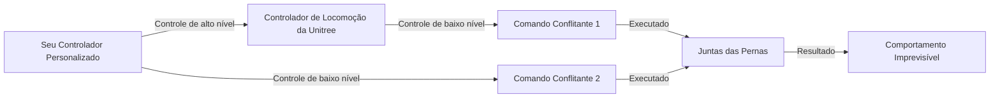

## Ligando o robô

Botão na bateria: pressione rapidamente + segure (+2 seg).
Demora ~1-2 minutos para ligar.

## Usando o controle remoto

Antes de executar qualquer comando remotamente, precisamos colocar o robô no estado correto. Como estamos usando um Unitree G1 EDU+ com controle R3-1, siga essa sequencia:

- `L2 + B` para colocar o robô em damping.
- `L2 + UP` para colocar o robô em ready.
- `R2 + A` para entrar no estado motion.
- `START` para alternar entre parado e andando.

Máquina de estados:

### Instruções de segurança

- Tenha uma pessoa próxima ao robô, pronta para apoiá-lo pelos ombros.
- Use a corda de segurança ou suporte, se disponível.
- Nos documentos do R3-1 e G1 mais novos, `L2 + B` é o modo damping. É a parada de emergência suave.
- Use `L2 + B` apenas se o robô ficar instável ou entrar em um estado inesperado.

### Diferença importante

Manuais antigos do G1 mencionam L1 + A para damping, L1 + UP para ready e R2 + X ou R1 + X para controle de operação. O mapeamento do R3-1 é diferente, como visto acima.

## Modo Debug

É possível desabilitar o controlador de locomoção colocando o robô no **Debug Mode**. Isso permite assumir o controle total do robô.

1. Com o G1 suspenso e em estado de damping, pressione a combinação `L2 + R2` no controle remoto. O G1 entrará em modo debug.
2. Pressione `L2 + A` para entrar em modo de posição (position mode) e assumirá uma posição específica de diagnóstico.
3. Pressione `L2 + B` para retornar ao estado de damping.

<table>
  <tr>
    <td></td>
    <td></td>
  </tr>
</table>

## Arquitetura

A stack de software é executada no computador de locomoção (locomotion computer) embarcado. Ela é responsável pelo controle de baixo nível do robô, incluindo o controle dos motores, o processamento dos dados dos sensores e a comunicação com o computador de desenvolvimento.

A Unitree expõe APIs para interagir com o robô usando o middleware CycloneDDS. A biblioteca `unitree_sdk2` permite se comunicar diretamente com o computador de locomoção via DDS. CycloneDDS e o ROS2 são compatíveis no nível DDS, então podemos usar o pacote ROS2 `unitree_ros2` para se comunicar com o robô.

As bibliotecas `unitree_sdk2` e `unitree_ros2` são usadas para acessar as funcionalidades nativas do robô. Do ponto de vista da programação, as mãos robóticas e outros periféricos (como o LiDAR Livox) são tratados como complementos e é necessário configurar o driver de cada periférico separadamente.

## Níveis de controle

Um conceito importante ao trabalhar com o SDK ou o driver ROS é o controle de "alto nível" (high-level) e "baixo nível" (low-level). O controle de alto nível refere-se ao controle do robô como um todo, enquanto o de baixo nível refere-se ao controle de cada junta ou motor individualmente. Os pacotes `unitree_sdk2` e `unitree_ros2` fornecem APIs para ambos os níveis.

No robô G1, o controle de alto nível abrange principalmente as juntas da parte inferior do corpo. É o controlador de locomoção da Unitree que cuida do controle de baixo nível para manter o robô equilibrado e capaz de realizar movimentos dinâmicos. Para as juntas da parte superior, você precisará implementar seus próprios algoritmos de controle de baixo nível.

Com esse conceito em mente, é possível que comandos conflitantes sejam enviados ao robô. Por exemplo, se tanto o controlador de locomoção da Unitree quanto o seu próprio controlador tentarem controlar a mesma junta, o resultado pode ser imprevisível. Esse problema pode ser melhor tratado pela Unitree em versões futuras. Por enquanto, esteja atento a essa questão e implemente sua lógica de controle com cuidado.

## Rede e interfaces

Os dispositivos de rede do G1 usam os seguintes endereços IP:

| Dispositivo | IP | Máscara | Usuário/Senha |
| --- | --- | --- | --- |
| Computador de Locomoção | `192.168.123.161` | 255.255.255.0 | não aberto ao usuário |
| Computador de Desenvolvimento (PC2) | `192.168.123.164` | 255.255.255.0 | unitree/123 |
| LiDAR Livox Mid-360 | `192.168.123.20` | 255.255.255.0 | N/A |
| G1 MCU | — | — | acessado via Computador de Locomoção |

O **Computador de Desenvolvimento (PC2)** é o que acessamos via SSH.
O **G1 MCU** é o microcontrolador de baixo nível das juntas e motores e não possui IP próprio, os dados são lidos através do Computador de Locomoção via protocolo DDS.

O robô oferece as seguintes interfaces:

| Nº | Conector | Descrição | Especificação |
| --- | --- | --- | --- |
| 1 | XT30UPB-F | VBAT | Saída de bateria 58V/5A (conectado diretamente à bateria) |
| 2 | XT30UPB-F | 24V | Saída 24V/5A |
| 3 | XT30UPB-F | 12V | Saída 12V/5A |
| 4 | RJ45 | 1000 BASE-T | GbE (gigabit Ethernet) |
| 5 | RJ45 | 1000 BASE-T | GbE (gigabit Ethernet) |
| 6 | Type-C | Type-C | USB 3.0 host, saída 5V/1.5A |
| 7 | Type-C | Type-C | USB 3.0 host, saída 5V/1.5A |
| 8 | Type-C | Type-C | USB 3.0 host, saída 5V/1.5A |
| 9 | Type-C | Alt Mode Type-C | USB 3.2 host e DP1.4 |
| 10 | 5577 | I/O OUT | 12V: saída 12V/3A |

É possível acessar o computador de desenvolvimento conectando um adaptador Type-C para HDMI na porta 9 para usar um monitor e teclado.

O método recomendado é conectar um computador externo via Ethernet usando as portas 4 ou 5.

