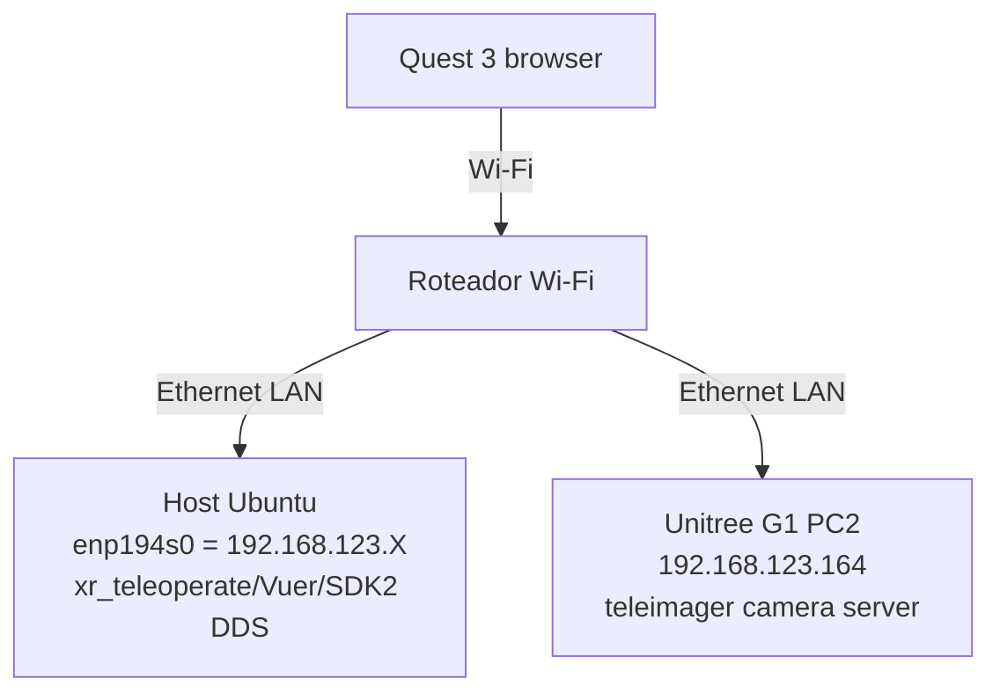

Os scripts de teleoperação estão no [repositório unitree-g1](https://github.com/MOBILAB-UDESC/unitree-g1).

A configuração ao final desse tutorial ficará como exemplificado no diagrama abaixo:



## Configuração do roteador

Baseado na documentação do repositório [xr_teleoperate](https://github.com/unitreerobotics/xr_teleoperate):

- [Router device](https://github.com/unitreerobotics/xr_teleoperate/wiki/Router_Device)
- [Network](https://github.com/unitreerobotics/xr_teleoperate/wiki/Network)

Condições ideais de Wi-Fi:

- 5GHz
- Largura de 80MHz ou 160MHz
- Sinal em torno de -50 dBm ou melhor
- Pouca sobreposição de canais

## Configuração no host

Adicione ao arquivo `packages/unitree_sdk2_python/unitree_sdk2py/core/channel_config.py`:

```python
ChannelConfigAutoDetermine = '''<?xml version="1.0"?>
<CycloneDDS>
  <Domain Id="any">
    <General>
      <Interfaces>
        <NetworkInterface autodetermine="true"/>
      </Interfaces>
      <AllowMulticast>spdp</AllowMulticast>
      <DontRoute>true</DontRoute>
    </General>
    <Discovery>
      <Peers>
        <Peer Address="192.168.123.161"/>
        <Peer Address="192.168.123.164"/>
      </Peers>
    </Discovery>
  </Domain>
</CycloneDDS>'''
```

Esta configuração é necessária porque o PC tem múltiplas interfaces de rede na mesma sub-rede:

- `enp194s0 = 192.168.123.2`
- `wlp195s0 = 192.168.123.106`

Sem a configuração explícita do DDS, a descoberta pode escolher a interface errada ou rotear inconsistentemente.

## Configuração do Meta Quest 3

Baseado nas instruções do repositório [xr_teleoperate](https://github.com/unitreerobotics/xr_teleoperate/wiki/XR_Device).

Ative o Modo Desenvolvedor no aplicativo Meta Horizon:

```text
Dispositivos -> seu Quest 3 -> Configurações do headset -> Modo Desenvolvedor -> ATIVADO
```

### Instalar `adb` no host

```sh
apt-get install adb
```

Liste os dispositivos:

```text
sudo adb devices
List of devices attached
2G0YC5ZG6P005M  unauthorized
```

1. Coloque o Quest 3 enquanto ele está conectado via USB.
2. Procure pelo alerta: _Allow USB debugging_?
3. Selecione _Always allow from this computer_ se disponível.
4. Pressione _Allow_.
5. Execute `sudo adb devices` novamente.

Saída esperada:

```text
2G0YC5ZG6P005M    device
```

Inicie o redirecionamento de porta:

```sh
sudo adb -s 2G0YC5ZG6P005M reverse tcp:8012 tcp:8012
```

Verifique o resultado:

```sh
sudo adb -s 2G0YC5ZG6P005M reverse --list
```

Saída esperada:

```text
UsbFfs tcp:8012 tcp:8012
```

### Configurar o certificado HTTPS

Gere um certificado autoassinado ([baseado na documentação da unitree](https://github.com/unitreerobotics/avp_teleoperate)):

```sh
openssl req -x509 -nodes -days 365 -newkey rsa:2048 -keyout key.pem -out cert.pem
```

## Configuração do Host

Siga as instruções do repositório [xr_teleoperate](https://github.com/unitreerobotics/xr_teleoperate). Siga as instruções de instalação. Embora estejamos usando `uv`, para o XR teleoperate siga as recomendações do conda:

https://github.com/unitreerobotics/xr_teleoperate#1--installation

## Configuração do PC2 (Unitree)

### Copiar certificados

Use SSH para criar o diretório de configuração no PC2 e copie os arquivos:

```sh
ssh unitree@192.168.123.164 'mkdir -p ~/.config/xr_teleoperate'
scp /home/alfakini/Developer/unitreeG1/cert.pem /home/alfakini/Developer/unitreeG1/key.pem unitree@192.168.123.164:~/.config/xr_teleoperate/
```

Verifique no PC2:

```sh
ssh unitree@192.168.123.164 'ls -l ~/.config/xr_teleoperate/'
```

Saída esperada:

```text
cert.pem
key.pem
```

Se o diretório `teleimager` no PC2 também esperar os arquivos diretamente:

```sh
scp /home/alfakini/Developer/unitreeG1/cert.pem /home/alfakini/Developer/unitreeG1/key.pem unitree@192.168.123.164:~/teleimager/
```

### Instalar pacotes no PC2

Estas notas resumem a instalação realizada nesta máquina para que possa ser reproduzida em outro sistema Ubuntu estilo Unitree/Jetson.

#### 1. Instalar Miniconda

```bash
wget https://repo.anaconda.com/miniconda/Miniconda3-latest-Linux-aarch64.sh -O /tmp/miniconda.sh
bash /tmp/miniconda.sh -b -u -p /home/unitree/miniconda3
rm /tmp/miniconda.sh
```

Se o Conda exigir aceitação dos Termos de Serviço do canal:

```bash
/home/unitree/miniconda3/bin/conda tos accept --override-channels --channel https://repo.anaconda.com/pkgs/main
/home/unitree/miniconda3/bin/conda tos accept --override-channels --channel https://repo.anaconda.com/pkgs/r
```

Inicialize o Conda para bash:

```bash
/home/unitree/miniconda3/bin/conda init bash
source ~/.bashrc
```

#### 2. Criar ambiente teleimager

```bash
/home/unitree/miniconda3/bin/conda create -n teleimager python=3.10 -y
conda activate teleimager
```

#### 3. Instalar pacotes do sistema

`libusb-1.0-0-dev` já estava instalado. `libturbojpeg-dev` não foi instalado porque o sudo exigia senha interativa.

Execute com acesso sudo:

```bash
sudo apt update
sudo apt install -y libusb-1.0-0-dev libturbojpeg-dev
```

#### 4. Instalar Tele Imager

O repositório já existia em `/home/unitree/teleimager`.

```bash
cd /home/unitree/teleimager
/home/unitree/miniconda3/envs/teleimager/bin/python -m pip install -e ".[server]"
```

#### 5. Correção de dependência

A versão atual do pacote `logging_mp` expõe `getLogger`, mas o Tele Imager `1.5.0` chama `get_logger`. Isso fazia tanto o `teleimager-server` quanto o `teleimager-client` falharem na inicialização.

O `pyproject.toml` local foi atualizado de:

```toml
"logging_mp",
```

para:

```toml
"logging_mp==0.1.6",
```

Em seguida, a instalação editável foi atualizada:

```bash
cd /home/unitree/teleimager
/home/unitree/miniconda3/envs/teleimager/bin/python -m pip install -e ".[server]"
```

#### 6. Permissões UVC

O usuário já está no grupo `video`, mas a regra udev do UVC não foi instalada porque o sudo exigia senha interativa.

Execute com acesso sudo:

```bash
cd /home/unitree/teleimager
bash setup_uvc.sh
```

Isso instala `/etc/udev/rules.d/10-libuvc.rules`, recarrega as regras udev e tenta recarregar o driver `uvcvideo`.

#### 7. Verificação

Verifique se os comandos estão disponíveis:

```bash
/home/unitree/miniconda3/envs/teleimager/bin/teleimager-server --help
/home/unitree/miniconda3/envs/teleimager/bin/teleimager-client --help
```

Execute a descoberta de câmera:

```bash
cd /home/unitree/teleimager
/home/unitree/miniconda3/envs/teleimager/bin/python -m teleimager.image_server --cf
```

O comando executou com sucesso. Pode exibir este log se o `setup_uvc.sh` não tiver sido executado:

```text
Failed to reload driver: Command 'sudo modprobe -r uvcvideo' returned non-zero exit status 1.
```

Este erro é da etapa de recarga do driver (apenas sudo); a descoberta continua funcionando.

#### 9. Uso típico

```bash
source ~/.bashrc
conda activate teleimager
cd /home/unitree/teleimager
teleimager-server --cf
```

Após preencher o `cam_config_server.yaml`, inicie o servidor:

```bash
teleimager-server
```

## Adicionar Câmera

Para usar a RealSense, use a porta USB 9.

- https://support.unitree.com/home/en/G1_developer
- https://github.com/unitreerobotics/xr_teleoperate/wiki/Camera_and_Image


```text
rs-enumerate-devices
Device info:
    Name                          : Intel RealSense D435I
    Serial Number                 : 406122071162
    Firmware Version              : 05.15.01.55
    Recommended Firmware Version  : 05.13.00.50
    Physical Port                 : /sys/devices/platform/3610000.xhci/usb2/2-3/2-3:1.0/video4linux/video0
    Debug Op Code                 : 15
    Advanced Mode                 : YES
    Product Id                    : 0B3A
    Camera Locked                 : YES
```

#### 8. Nota sobre RealSense

O modo RealSense requer `pyrealsense2`. As wheels pip disponíveis para `pyrealsense2` em `aarch64` exigiam `GLIBC_2.32`, mas o sistema Ubuntu do G1 tem GLIBC mais antigo. Versões testadas incluíram `2.58.1.10581` e `2.55.1.6486`; ambas falharam com o mesmo requisito de GLIBC.

Para usar `teleimager-server --cf --rs` ou `teleimager-server --rs`, compile/instale `librealsense` e suas bindings Python localmente no sistema em vez de usar a wheel pip.

